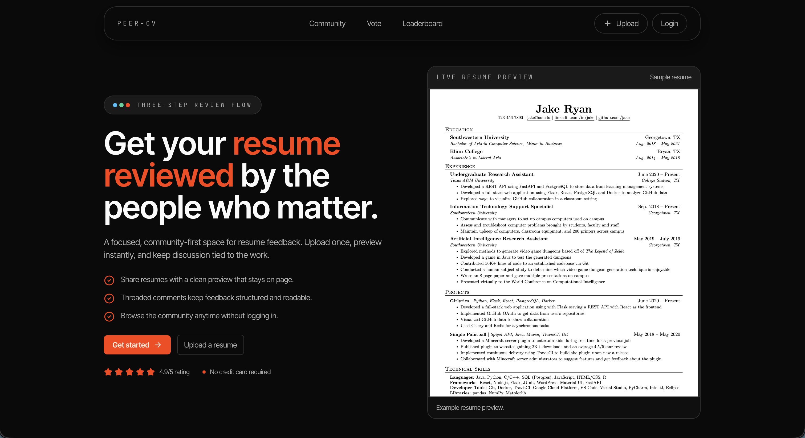

# PeerCV 🚀

> **A dedicated community platform for ranked resume feedback.**

[](https://peer-cv.vercel.app)
[](https://opensource.org/licenses/MIT)

## 📖 About
Getting quality resume feedback is hard. Reddit threads are messy, and group chats are noisy.
**PeerCV** solves this by creating a structured feed where users can upload resumes, get nested feedback, and receive a community rank.

## ✨ Features
- **🏆 Fair Ranking System:** A voting algorithm that prevents spam (1 vote per user/resume) and ranks profiles on a global leaderboard.
- **💬 Nested Comments:** Threaded discussions to keep specific advice organized.
- **🔗 Shareable Links:** Unique profile URLs for easy sharing on Discord or Slack.
- **📄 PDF Handling:** Seamless PDF viewing and rendering directly in the browser.
- **🔐 Authentication:** Secure JWT-based authentication.

---

## 🛠 Tech Stack

**Frontend:**


**Backend:**


---

## 🚀 Getting Started Locally

To run this project locally, you will need to set up both the backend (FastAPI) and the frontend (Next.js).

### Prerequisites
- Node.js (v18+)
- Python (3.12+)
- PostgreSQL
- uv (recommended) or pip/venv

### 1. Backend Setup (FastAPI)

```bash
cd backend
uv sync
uv run uvicorn app.main:app --reload
```

Create `backend/.env` with:

```bash
DATABASE_URL=postgresql+asyncpg://...
JWT_SECRET=your-secret
IMAGEKIT_PUBLIC_KEY=your-public-key
IMAGEKIT_PRIVATE_KEY=your-private-key
IMAGEKIT_URL=https://ik.imagekit.io/your-id
```

The backend runs on `http://localhost:8000`.

### 2. Frontend Setup (Next.js)

```bash
cd frontend
npm install
```

Create `frontend/.env.local`:

```bash
NEXT_PUBLIC_API_URL=http://localhost:8000
```

```bash
npm run dev
```

The frontend runs on `http://localhost:3000`.

---

## 📸 Preview



---

## 🤝 Contributing
Contributions are welcome! If you have suggestions for how to improve the ranking algorithm or UI, please fork the repo and create a pull request.

## 👤 Author
Elrich Chen

LinkedIn · GitHub · Portfolio
